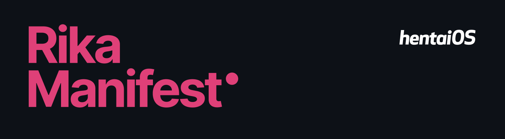

#  #

## Field of furries. ##

## Requirements ##

- Around 100G of storage
- A usable internet (At least Gigabit)
- Computer / Server with at least 16 GB of RAM

## Sync ##

```bash
# Initialize local repository
repo init -u https://github.com/hentaiOS/platform_manifest -b Rika

# Sync
repo sync -c -j$(nproc --all) --force-sync --no-clone-bundle --no-tags
```

## Build ##

```bash
# Set up environment
$ . build/envsetup.sh

# Choose a target
$ lunch hentai_$device-userdebug

# Build the code
$ make otapackage -jX
```
